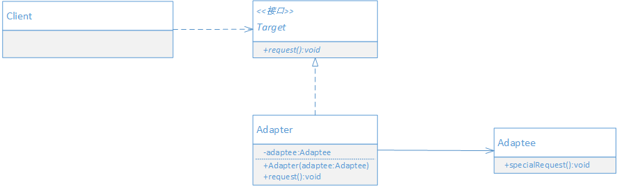

## 定义

将类的接口转换成客户期望的接口。适配器模式使接口不兼容的而不能一起工作的类可以一起工作。

## 生活中的例子

在使用笔记本时，有时我们需要将笔记本连接到一个大的显示器上。假设笔记本使用的是DVI接口，
而显示用的VGA接口，这个时候就需要一个转换头来将DVI转换为VGA，以便在显示器上显示笔记本的
内容。这个转换头一个视频显示适配器。

## UML



- Client: 客户端，调用自己需要的领域接口Target
- Target: 定义客户端需要的特定领域相关接口
- Adaptee: 需要被适配的接口。已经存在，通常能满足客户端的功能要求，但与客户端需要的接口不兼容
- Adapter: 适配器，将Adaptee适配成Client需要的Target。

## 场景案例

现有一个记录日志的功能需要以文件的形式记录。

```java

// 模拟数据
public class LogData {
    public final static Map<String, LogModel> DATA = new HashMap<>();

    // 模拟数据
    static  {
        LogModel model = new LogModel();
        model.setLogId(UUID.randomUUID().toString());
        model.setOperateUser("张三");
        model.setOperateTime("2019-11-20 18:36");
        DATA.put(model.getLogId(),model);

        model = new LogModel();
        model.setLogId(UUID.randomUUID().toString());
        model.setOperateUser("李四");
        model.setOperateTime("2019-11-19 18:36");
        DATA.put(model.getLogId(),model);

        model = new LogModel();
        model.setLogId(UUID.randomUUID().toString());
        model.setOperateUser("赵柳");
        model.setOperateTime("2019-101-20 18:36");
        DATA.put(model.getLogId(),model);
    }
}

// 日志数据对象
public class LogModel {
    private String logId;
    private String operateUser;
    private String operateTime;
    // 省略 getter, setter
}

// 操作日志文件接口
public interface LogFileOperateApi {
    Map<String, LogModel> readLog();
    void writeLog(Map<String, LogModel> data);
}

public class LogFileOperate implements LogFileOperateApi {
    public Map<String, LogModel> readLog() {
        // 模拟从文件中读取日志
        System.out.println("从文件中读取日志");
        return LogData.DATA;
    }

    public void writeLog(Map<String, LogModel> data) {
        System.out.println("写入日志到文件");
        LogData.DATA.putAll(data);
    }
   
}

```

一段时间后决定要采用数据库来存储日志。假设采用数据库存储日志的接口和文件存储日志的接口不一致

```java

public interface LogDbOperateApi {
    void insertLog(LogModel log);
    Map<String, LogModel> mapLog();
    LogModel get(String logId);
}

public class LogDbOperate implements LogDbOperateApi {
    public void insertLog(LogModel log) {
        System.out.println("记录日志到数据库");
        LogData.DATA.put(log.getLogId(), log);
    }

    public Map<String, LogModel> mapLog() {
        System.out.println("从数据库中读取日志列表");
        return LogData.DATA;
    }

    public LogModel get(String logId) {
        System.out.println("从数据库读取单条日志");
        return LogData.DATA.get(logId);
    }
}

```

现在需求又来，客户希望让日志系统第二版实现同时支持数据库存储和文件存储两种方式。由于两个版本的接口不一致，导致客户端无法以同样的方式来使用第一个版本的日志实现。

我们可以按照第二版的接口要求重新实现一个文件操作的日志实现。但应该想办法能复用第一版的功能，而不是重新实现。

此时就可以采用适配器模式来实现第一版的功能复用

## 代码实现

适配器

```java

public class Adapter implements LogDbOperateApi {
    private LogFileOperateApi adaptee;
}


```

## 好处 


## 适用场景

以下情况可以考虑使用适配器模式

