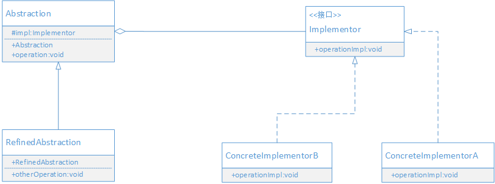

## 定义

将抽象部分与它的实现部分分离，使它们都可以独立地变化

> 桥接模式的本质：分离抽象和实现


### 什么是桥接
桥接就是在不同的东西之间搭一个桥，让它们可以连接起来，互相通讯和使用。在桥接模式中，就是为被分离的抽象部分和实现部分搭桥。

桥接在程序上的体现就是抽象部分拥有实现部分的接口对象，维护桥接就是维护这个关系。

## UML



- Abstraction: 抽象部分接口。维护一个实现部分的对象引用。抽象部分接口中的方法通常是和具体业务相关的方法。
- RefinedAbstraction: 扩展抽象部分的接口。通常定义跟实际业务相关的方法，这些方法可能会调用Abstraction中定义的方法，也可能调用实现部分的对象来完成。
- Implementor: 定义实现部分的接口。接口的方法无需和Abstraction中的方法一致。Implementor定义基本操作，Abstraction定义基于这些基本操作的业务方法。
- ConcreteImplementor: 实现Implementor接口的对象。

## 场景案例

考虑一个发送提示消息的业务功能。

消息分为普通消息、加急消息和特急消息等多种。加急消息需要在消息上添加加急标识，而特急消息除了添加特急标识外，还需做一条催促记录，定时催促。
从发送消息的手段上分为：系统内短消息，手机短信，邮件等。

### 分析

从上面需求分析，功能变化具有两个维度
- 一个是抽象的消息这边，包括普通消息，加急消息和特急消息，加急和特急消息会扩展普通消息；
- 另一个是具体消息发送的方式，包括站内消息，手机短信，邮件。发送方式是平等的，可以被切换。

因此可以将消息和消息发送方式分离开，使它们相互独立，这样可以使扩展变得简单。

## 代码实现

```java

// 定义发送消息的统一接口
public interface MessageImplementor {
    /**
     * 发送消息
     */
    void send(String message, String toUser);
}

// 以邮件的方式发送消息
public class MessageEmail implements MessageImplementor {
    @Override
    public void send(String message, String toUser) {
        System.out.println("使用邮件的方式，发送消息[" + message + "]给" + toUser);
    }
}

// 以站内信的方式发送消息
public class MessageSMS implements MessageImplementor {
    @Override
    public void send(String message, String toUser) {
        System.out.println("使用站内信的方式，发送消息[" + message + "]给" + toUser);
    }
}

// 定义抽象的消息对象
public abstract class AbstractMessage {
    // 持有发送消息的方式对象
    protected MessageImplementor impl;
    public AbstractMessage(MessageImplementor impl) {
        this.impl = impl;
    }

    public void sendMessage(String message, String toUser) {
        impl.send(message, toUser);
    }
}

// 普通消息
public class CommonMessage extends AbstractMessage {
    public CommonMessage(MessageImplementor impl) {
        super(impl);
    }

    public void sendMessage(String message, String toUser) {
        super.sendMessage(message, toUser);
    }
}

// 加急消息
public class UrgencyMessage extends AbstractMessage {
    public UrgencyMessage(MessageImplementor impl) {
        super(impl);
    }

    public void sendMessage(String message, String toUser) {
        message = "加急: " + message;
        super.sendMessage(message, toUser);
    }

    // 扩展自己的功能，监控消息的处理
    public void watch(String messageId) {
        System.out.println("监控消息的处理");
    }
}

```

上面实现对普通消息，加急消息的处理，发送消息方式有邮件和站内信。

现在需要添加特急消息的处理，同时添加一个通过手机短信发送消息的方式。就只需要在消息抽象部分添加一个特急消息类；
在实现部分添加一个实现类即可。无需对现有的功能进行修改，并实现功能的扩展。

```java

// 特急消息的处理
public class SpecialUrgencyMessage extends AbstractMessage {
    public SpecialUrgencyMessage(MessageImplementor impl) {
        super(impl);
    }

    public void hurry(String messageId) {
        System.out.println("催促用户处理消息内容");
    }

    @Override
    public void sendMessage(String message, String toUser) {
        message = "特急: " + message;
        super.sendMessage(message, toUser);
        hurry(message);
    }
}

// 使用手机短信发送消息
public class MessageMobile implements MessageImplementor {
    @Override
    public void send(String message, String toUser) {
        System.out.println("使用手机短信的方式，发送消息[" + message + "]给" + toUser);
    }
}

```

## 好处 

- 桥接模式分离了抽象部分和实现部分，从而提高了系统的灵活性。抽象部分和实现部分独立分开，有助于对系统进行分层。
- 桥接模式分离了抽象部分和实现部分，使得抽象部分和实现部分可以独立扩展，从而提高了系统的扩展性。
- 可以在运行时动态组合具体的实现，从而达到动态变换功能的目的。

## 适用场景

以下情况可以考虑使用桥接模式

- 如果希望在抽象部分和实现部分可以增加灵活性，并且不希望使用继承来维护抽象部分和实现部分的关系，就可以使用桥
接模式，将抽象部分和实现部分分开，然后在运行期间动态切换。
- 如果一个类出现两个以上的变化维度，且每个维度都可以独立进行扩展时，可以使用桥接模式，让抽象部分和实现部分可以独立地变化。
