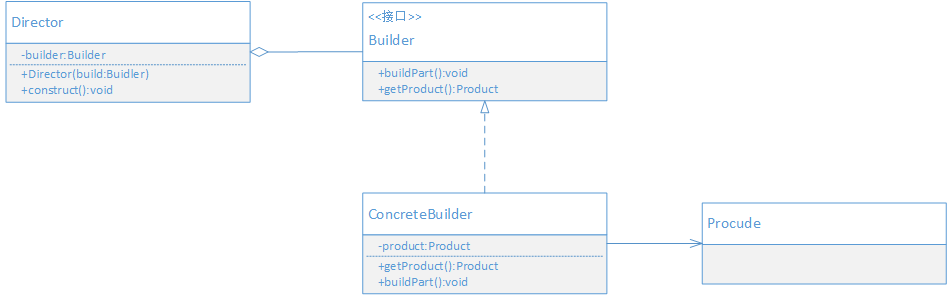

## 目的

将复杂对象的构建与它的表示分离，使得同样的构建过程可以创建不同的表示。

构建者模式的本质：分离整体构建算法和部件构造

> 构建者模式主要功能时构建复杂的产品。通过分离构建算法和具体的构造实现，从而使得构建算法可以重用。
> 具体构造的实现也可以很方便地扩展和切换，从而可以灵活地组合来构建不同的产品对象。

## UML



- Builder：抽象构建者，定义创建Product对象所需的各个部件的操作。
- ConcreteBuilder：具体构建者实现，实现各个部件的创建，并负责组装Product对象的各个部件。
- Director：指导者，使用构建者的对象，以统一的过程来构建所需的Product对象。
- Product：被构建者创建的复杂对象。

## 场景案例
继续使用导出数据到文件的例子，在工厂方法模式中解决了如何选择具体导出方式的问题，并没有涉及每种方式具体如何实现。
假设现在有对导出内容的格式有以下要求：

- 文件内容必须包含文件头，文件体和文件尾。
- 文件头部分需要描述数据来源和编号。
- 文件体要求每一行描述一条数据，字段间用逗号分隔
- 文件尾要求有导出人和导出日期

无论输出哪种文件格式，步骤都分为以下4步：

- 先准备文件头内容
- 再准备文件体内容
- 然后准备文件尾内容
- 最后输出到文件

导出输出格式的文件时，都会重复上面的步骤，应该将这个步骤提出来形成公共的处理工程。这样可以在处理过程不变的情况下，
能方便地切换不同的输出格式的处理。

## 代码实现

定义构建者接口，定义创建输出文件对象所需的各个部件的操作

```java
public interface Builder {
    void buildHeader(Header header);
    
    void buildBody(List<Body> data);
    
    void buildFooter(Footer footer);
    
    String getExportFile();
    
}
```

具体构建实现
```java
public class XmlBuilder implements Builder {
    private StringBuffer buffer;

    public XmlBuilder() {
        buffer = new StringBuffer("<?xml version='1.0' encoding='uft-8'?>\n");
    }

    @Override
    public void buildHeader(Header header) {

        buffer.append("<header>\n");
        buffer.append("\t<uuid>").append(header.getUuid()).append("</uuid>\n");
        buffer.append("\t<source>").append(header.getSource()).append("</source>\n");
        buffer.append("</header>\n");
    }

    @Override
    public void buildBody(List<Body> data) {
        buffer.append("<body>\n");
        for(Body body : data) {
            buffer.append("\t<data>\n");
            buffer.append("\t\t<name>").append(body.getName()).append("</name>\n");
            buffer.append("\t\t<amount>").append(body.getAmount()).append("</amount>\n");
            buffer.append("\t\t<price>").append(body.getPrice()).append("</price>\n");
            buffer.append("\t</data>\n");
        }
        buffer.append("</body>\n");
    }

    @Override
    public void buildFooter(Footer footer) {
        buffer.append("<footer>\n");
        buffer.append("\t<operator>").append(footer.getOperator()).append("</operator>\n");
        buffer.append("\t<date>").append(footer.getOperatorDate()).append("</date>\n");
        buffer.append("</footer>\n");
    }

    @Override
    public String getExportFile() {
        return buffer.toString();
    }
}

public class TxtBuilder implements Builder{
    private StringBuffer file;
    public TxtBuilder() {
        file = new StringBuffer();
    }

    @Override
    public void buildHeader(Header header) {
        file.append(header.getUuid()).append(", ");
        file.append(header.getSource()).append("\n");

    }

    @Override
    public void buildBody(List<Body> data) {
        for(Body body : data) {
            file.append(body.getName()).append(",");
            file.append(body.getAmount()).append(",");
            file.append(body.getPrice()).append("\n");
        }
    }

    @Override
    public void buildFooter(Footer footer) {
        file.append(footer.getOperator()).append(",");
        file.append(footer.getOperatorDate());
    }

    @Override
    public String getExportFile() {
        return file.toString();
    }
}
```

定义指导者，指导构建过程

```java
public class Director {
    public Builder builder;

    public Director(Builder builder) {
        this.builder = builder;
    }

    public void construct(Header header, List<Body> data, Footer footer) {
        builder.buildHeader(header);
        builder.buildBody(data);
        builder.buildFooter(footer);
    }
}
```

调用演示
```java
public class Application {
    public static void main(String[] args) {
        String result = build(new XmlBuilder());
        System.out.println(result);

        result = build(new TxtBuilder());
        System.out.println(result);
    }

    private static String build(Builder builder) {
        Header header = new Header(UUID.randomUUID().toString(), "测试");

        List<Body> data = new ArrayList<>(3);
        data.add(new Body("测试数据1","51.4", "10"));
        data.add(new Body("测试数据2","67.5", "5"));
        data.add(new Body("测试数据3","78.9", "3"));

        Footer footer = new Footer("张三", "2019-11-16");
        Director director = new Director(builder);
        director.construct(header, data, footer);
        return builder.getExportFile();
    }
}
```
## 好处 

- 松散耦合：构建者模式将产品构建的过程独立出来，使它和具体产品的表现之间松散耦合，使得构建算法可以复用。
- 更好的复用性：通过分类构建过程和具体产品实现，使得构建算法和具体产品都可以复用。

## 适用场景

以下情况可以考虑使用构建者模式

- 如果创建对象的算法，应该独立于该对象的组成部分时，可以使用构建者模式。
- 如果同一个构建过程有不同的表示时，可以使用构建者模式，从而使不同表示可以复用同一个构建过程。
- 如果需要构建的对象是一个非常复杂的对象时，可以使用构建者模式，把复杂的创建过程通过Builder来实现，这样既简洁直观，又具有很好的扩展性。