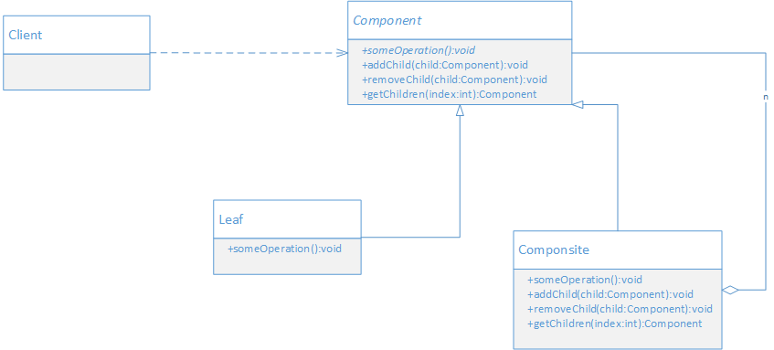

## 定义

将对象组合成树型结构以表示 部分-整体 的层次结构。组合模式使得用户对单个对象和组合对象的使用具有一致性。

> 组合模式的目的是：让客户端不需要区分操作的是组合对象还是叶子对象，而是以统一的方式来操作。
> 组合模式的本质：统一叶子对象和组合对象


## UML



- Component: 抽象的组件对象，为组合中的对象声明接口，让客户端可以通过这个接口来访问和管理整个对象结构。
- Leaf: 叶子节点对象，定义和实现叶子对象的行为
- Composite: 组合对象，通常存储子组件，定义包含子组件的那些组件的行为，并实现组件接口中与子组件有关的操作。
- Client: 通过组件接口来操作组合结构里面的组件对象。

## 场景案例

生成树型结构数据。树型结构通常有一个根节点，树枝节点和叶子节点。

- 根节点没有父节点，可以包含其他节点。
- 树枝节点，可以包含其他节点
- 叶子节点，没有子节点

进一步分析发现，根节点和树枝节点是类似的，都是可以包含其他节点，因此可以把它们称为容器节点。

这样，树型的节点就分容器节点和叶子节点。将它们实现成对象，就是容器对象和叶子对象，容器对象是一种组合对象，可以包含其他容器对象或叶子对象。

## 代码实现

```java

// 不管是容器对象还是叶子对象，都可以看做为树型结构的一个组件，
// 因此抽象一个组件对象，定义通用的功能
public abstract class Component {
    public abstract void printStruct(String preStr);

    public void addChild(Component child) {
        throw new UnsupportedOperationException("不支持这个功能");
    }

    public void removeChild(Component child) {
        throw new UnsupportedOperationException("不支持这个功能");
    }

    public Component getChildren(int index) {
        throw new UnsupportedOperationException("不支持这个功能");
    }
}

// 叶子对象和容器对象继承组件对象

// 叶子对象没有子节点，因此不重写子节点相关的操作
public class Leaf extends Component {
    private String name = "";
    @Override
    public void printStruct(String preStr) {
        System.out.println(preStr + "-" + name);
    }

    public Leaf(String name) {
        this.name = name;
    }
}

public class Composite extends Component {
    private List<Component> childComponents = new ArrayList<>();
    private String name = "";

    public Composite(String name) {
        this.name = name;
    }

    @Override
    public void addChild(Component child) {
        childComponents.add(child);
    }

    @Override
    public void removeChild(Component child) {
        childComponents.remove(child);
    }

    @Override
    public Component getChildren(int index) {
        return childComponents.get(index);
    }

    @Override
    public void printStruct(String preStr) {
        System.out.println(preStr + "-" + name);

        preStr += " ";
        for(Component component : childComponents) {
            component.printStruct(preStr);
        }
    }
}

// 客户端调用
public class Application {
    public static void main(String[] args) {
        Component root = new Composite("服装");
        Component nan = new Composite("男装");
        Component nv = new Composite("女装");

        Component chen = new Leaf("衬衣");
        Component jia = new Leaf("夹克");
        Component qun = new Leaf("裙子");
        Component tao = new Leaf("套装");

        root.addChild(nan);
        root.addChild(nv);

        nan.addChild(chen);
        nan.addChild(jia);
        nv.addChild(qun);
        nv.addChild(tao);

        root.printStruct("");
    }
}

```

## 好处 

- 组合模式通过统一组合对象和叶子对象，使得客户端调用时，无需区分，从而简化了客户端调用；
- 组合模式定义了包含基本对象和组合对象的类层次结构。


## 适用场景

以下情况可以考虑使用组合模式

- 如果希望表示对象的部分-整体层次结构，可以使用组合模式把整体和部分的操作统一起来，使得层次结构实现更简单。