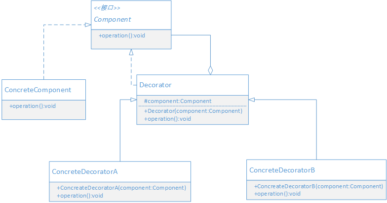

## 定义

动态地给一个对象添加一些额外的职责，就增加功能来说，装饰模式比生成子类更为灵活

> 装饰模式实现从对象外部来动态给对象增加功能。
> 装饰模式的本质是动态组合。装饰模式是通过把复杂功能简化，分散化，然后在运行期间，根据需要来动态组合的模式

## UML



- Component 组件对象的接口
- ConcreteComponent 具体的组件对象，通常是被装饰的对象。
- Decorator 抽象装饰器，定义一个与组件接口一致的接口，并持有一个Component对象(被装饰的对象)
- ConcreteDecorator 具体装饰器，实现具体要向被装饰器对象添加的功能。

## 场景案例

实现奖金计算的功能，要求如下

每个员工有当月业务奖金，个人累计奖金；经理或主管除了个人奖金外，还有团队奖金。

奖金计算方式 

- 个人当月业务奖金 = 当月销售额 * 3%
- 个人累计奖金 = 总的回款额 * 0.1%
- 团队奖金 = 团队总销售额 * 1%


## 代码实现

```java

// 定义计算奖金的组件接口
public abstract class Component {
    /**
    * 根据user来计算奖金
    */
    public abstract double calcPrize(String user);
}

public class ConcreteComponent extends Component {
    public double calcPrize(String user) {
        // 默认实现
        return 0;
    }
}

// 装饰器
public abstract class Decorator extends Component {
    protected Component c;
    
    public Decorator(Component c) {
        this.c = c;
    }
    
    public double calcPrize(String user) {
        return c.calcPrize(user);
    }
}

// 定义一系列装饰器对象
public class MonthPrizeDecorator extends Decorator {
    // 计算当月业务奖金
    public MonthPrizeDecorator(Component c) {
        super(c);
    }
    
    public double calcPrize(String user) {
        double money = super.calcPrize(user);
        double prize = TempDB.mapMonthSaleMoney.get(user) * 0.03;
        System.out.println(user + " 当月业务奖金:" + prize);
        return money + prize;
    }
}

public class SumPrizeDecorator extends Decorator {
    // 累计奖金计算
    public SumPrizeDecorator(Component c) {
            super(c);
        }
        
        public double calcPrize(String user) {
            double money = super.calcPrize(user);
            // 计算累计奖金，按人员去获取累计的业务额，然后再乘以0.1%
            // 这里简单演示，假设大家的累计业务额都1000000
            double prize = 1000000 * 0.001;
            System.out.println(user + " 累计奖金:" + prize);
            return money + prize;
        }
}


public class GroupPrizeDecorator extends Decorator {
    // 计算当月团队业务奖金
    public GroupPrizeDecorator(Component c) {
            super(c);
        }
        
        public double calcPrize(String user) {
            double money = super.calcPrize(user);
            // 计算当月团队业务奖金，先计算出团队总的业务额，然后再乘以1%
            // 假设都是一个团队的
            double group = 0.0;
            for(double d : TempDB.mapMonthSaleMoney.values()) {
                group += d;
            }
            double prize = group * 0.01;
            System.out.println(user + " 当月团队业务奖金:" + prize);
            return money + prize;
        }
}

public class Application {
    public static void main(String[] args) {
        // 首先需要创建被装饰的对象，然后创建需要的装饰对象，接着组合装饰对象，依次对前面的对象进行装饰。
        Component c = new ConcreteComponent();
        Decorator month = new MonthPrizeDecorator(c);
        Decorator sum = new SumPrizeDecorator(month);
        
        double zs = sum.calcPrize("张三");
        System.out.println("======== 张三应得奖金: " + zs + "========");
        
        double ls = sum.calcPrize("李四");
        System.out.println("======== 李四应得奖金: " + ls + "========");
        
        // 业务经理
        Decorator group = new GroupPrizeDecorator(sum);
        double ww = group.calcPrize("王五");
        System.out.println("======== 王五经理应得奖金: " + ww + "========");
    }
}
```

由于计算奖金的逻辑比较复杂，需要在不同的情况下进行不同的运算，为了灵活性，把多种计算奖金的方式分散到不同的装饰器对象中，
采用动态组合的方式，来给基本的计算奖金对象增添计算奖金的功能，每个装饰器相当于计算奖金的一部分。

## 好处 

- 装饰模式把一系列复杂的功能分散到每个装饰器中，通常一个装饰器只实现一个功能，这样实现装饰器变得简单，更有利于装饰器功能的复用。
-  相比继承来说，装饰模式更灵活。继承是静态的，在编译器扩展功能，且所有子类都有一样的功能。装饰模式把功能分离到每个装饰器中，
然后通过对象组合的方式在运行时动态地组合功能，每个被装饰器的对象是由运行期动态组合的功能决定的。

## 适用场景

以下情况可以考虑使用装饰模式

- 希望在不影响其他对象的情况下，以动态、透明的方式给对象添加职责，就可以使用装饰模式。
- 在不适合使用子类来进行扩展时，可以使用装饰器模式，通过对象组合的方式，来扩展功能。