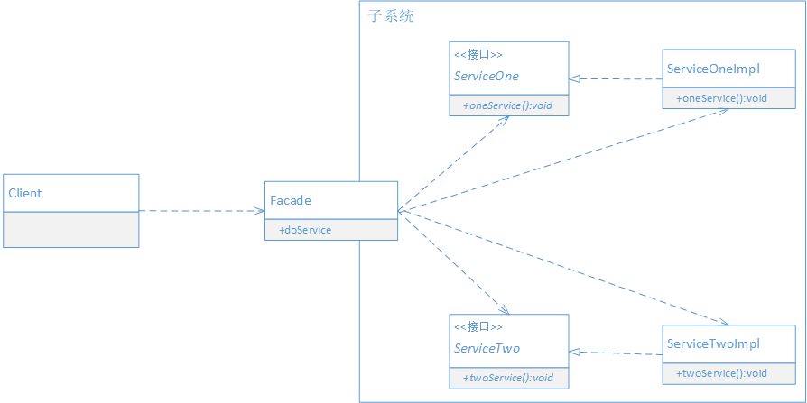

## 定义

为子系统中的一组接口提供一个一致的接口，让外部系统能更简单地使用子系统的功能。

> 外观模式的目的不是给子系统添加新功能，而是为了让外部减少与子系统内部多个模块的交互，松散耦合，从而让外部能够更简单地使用子系统。
> 外观模式的本质是：封装交互，简化调用

## UML



## 场景案例

假设现在需要开发一个代码生成工具，能根据配置生成代码，且生成出来的每个模块都具有三层架构：表现层，逻辑层和数据层。

## 代码实现

```java

// 示意代码,配置类
public class ConfigModel {
    private boolean needPresentation = true;
    private boolean needBusiness = true;
    private boolean needDAO = true;

    public boolean isNeedPresentation() {
        return needPresentation;
    }

    public boolean isNeedBusiness() {
        return needBusiness;
    }

    public boolean isNeedDAO() {
        return needDAO;
    }

    public void setNeedPresentation(boolean needPresentation) {
        this.needPresentation = needPresentation;
    }

    public void setNeedBusiness(boolean needBusiness) {
        this.needBusiness = needBusiness;
    }

    public void setNeedDAO(boolean needDAO) {
        this.needDAO = needDAO;
    }
}

// 配置管理
public class ConfigManager {
    private static ConfigManager manager = new ConfigManager();
    private static ConfigModel config;

    private ConfigManager() {
        config = new ConfigModel();
    }

    public static ConfigManager getInstance() {
        return manager;
    }

    public ConfigModel getConfig() {
        return config;
    }
}

// 示意生成表现层的模块
public class Presentation {
    protected void generate() {
        // 从配置管理中获取配置
        ConfigModel config = ConfigManager.getInstance().getConfig();
        if(config.isNeedPresentation()) {
            // 按照要求生成代码,并保存文件，这里仅做示意
            System.out.println("正在生成表现层代码文件");
        }
    }
}

// 示意生成业务层代码的模块
public class Business {
    protected void generate() {
        // 从配置管理中获取配置
        ConfigModel config = ConfigManager.getInstance().getConfig();
        if(config.isNeedBusiness()) {
            // 按照要求生成代码,并保存文件，这里仅做示意
            System.out.println("正在生成业务层代码文件");
        }
    }
}

// 示意生成DAO层代码的模块
public class Dao {
    protected void generate() {
        // 从配置管理中获取配置
        ConfigModel config = ConfigManager.getInstance().getConfig();
        if(config.isNeedDAO()) {
            // 按照要求生成代码,并保存文件，这里仅做示意
            System.out.println("正在生成DAO层代码文件");
        }
    }
}

// 门面类
public class Facade {
    private Presentation presentation;
    private Business business;
    private Dao dao;

    public Facade() {
        presentation = new Presentation();
        business = new Business();
        dao = new Dao();
    }

    public void generate() {
        presentation.generate();
        business.generate();
        dao.generate();
    }
}

// 示意外部模块调用
public class Application {
    public static void main(String[] args) {
        Facade facade = new Facade();
        facade.generate();
    }
}

```

上述代码如果不采用门面模式，那么外部模块就需要与子系统内部的多个模块进行交互。并且还要清楚每个模块的作用。

## 好处 

1. 外观模式不仅方便了客户端的调用，还是封装了系统内部的细节功能。如果后面调用模块的算法发生变化，只需修改Facade的实现即可
2. 外观模式实现了功能的复用，可以被多个外部系统调用。
3. 对使用外观模式的人员来说，节省了学习成本

> 外观模式很好地体现了“迪米特法则”。又称 最少知识原则

## 适用场景

以下情况可以考虑使用外观模式

- 希望为一个复杂的子系统提供一个简单接口供外部系统使用时，可以使用外观模式来实现大部分客户需要的功能，从而简化客户的调用。
- 希望让客户端与抽象类的实现松散耦合，可以使用外观模式将子系统与客户端分离，从而提高子系统的独立性和可移植性。
- 如果要构建多层结构的系统，可以使用外观模式，使用外观对象作为每层的入口，这样简化层间调用，松散层次之间的依赖关系。
