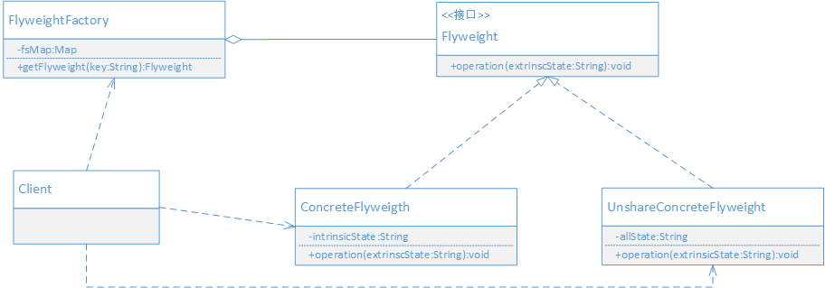

## 场景案例

考虑这样一个功能，为系统加入权限控制。

普通用户具有查看所属部门的人员列表权限，但不能查看每个用户的薪资；

部门经理具有查看所属部门的人员列表权限，同时也可以查看每一个用户的薪资。

### 分析

对于 人员列表 的查看权限，每授权给一个用户，在数据库就会有一条记录，如果有一万个用户对 人员列表 有查看权限，就会有一万条记录；按照以往的实现方式，就会有一万个对象实例，而这些实例中有大部分的数据时重复的。最终导致系统当中，存在大量细粒度对象，而且存在大量的重复数据，严重耗费内存。

如果能有效地减少对象的数量，减少重复数据，就可以节省不少的内存。一个基本思路是：缓存这些包含重复数据的对象，让这些对象只出现一次。

因此需要分离对象实例中，哪些数据时不变且重复出现的，将这部分的数据缓存，通常把它们称为对象的内部状态。而变化的部分称为外部状态

把内部状态分离出来共享，称之为享元，通过共享享元对象来减少对内存的占用。把外部状态分离出来，让应用在使用的时候进行维护，并在需要的时候传递给享元对象使用。

为了控制对内部状态的共享，并且让外部能方便使用共享数据，可以提供一个工厂来管理享元。

## 定义

运用共享技术有效地支持大量细粒度的对象。

> 享元模式设计的重点在于分离变与不变。把一个对象的状态分成内部状态和外部状态，内部状态是不变的，外部状态是可变的。
通过共享不变的部分，达到减少对象数量并节约内存的目的。

> 享元模式的本质是：分离与共享。分离对象状态中的变与不变的部分，共享对象中不变的部分。

在使用享元模式时，需要考虑哪些状态需要分离？如何分离？分离后如何处理？哪些需要共享？如何管理共享的对象？外部如何使用共享的享元对象？是否需要不共享的对象？等等。

## UML



- Flyweight: 享元接口, 通过这个接口传入外部的状态，在享元对象的方法处理中可能使用外部状态。
- ConcreteFlyweight: 具体的享元实现，必须是可共享的，封装Flyweight的内部状态。
- UnsharedConcreteFlyweight: 非共享的享元实现对象。非共享的享元实现对象通常是对共享享元对象的组合对象。
- FlyweightFactory: 享元工厂，用来创建和管理共享的享元对象，并对外提供访问共享享元的接口。
- Client: 客户端，维持一个对Flyweight的引用，计算或存储享元对象的外部状态，可以访问共享和不共享的Flyweight对象。

## 代码实现

0) 安全实体, 权限, 模拟数据

```java

public class SecurityEntity {
    private String name;

    public SecurityEntity(String name) {
        this.name = name;
    }

    public String getName() {
        return name;
    }
}

public class Permit {
    private String name;

    public Permit(String name) {
        this.name = name;
    }

    public String getName() {
        return name;
    }
}

public class TestDB {
    public static List<String> data = new ArrayList<>();

    static {
        data.add("张三,人员列表,查看");
        data.add("李四,人员列表,查看");
        data.add("李四,薪资数据,查看");
        data.add("李四,薪资数据,修改");
        for (int i = 0; i < 3; i++) {
            data.add("用户" + i + ",人员列表,查看");
        }
    }
}

```

1) 定义一个享元接口
```java

public interface Flyweight {
    /**
     * 判断传入的安全实体和权限，是否和享元对象内部状态匹配
     * @param entity 安全实体
     * @param permit 权限
     * @return true， false
     */
    boolean match(SecurityEntity entity, Permit permit);
}

```

2) 实现享元对象, 这个对象需要封装授权数据中重复出现的数据
```java

public class AuthorizationFlyweight implements Flyweight {
    /**
     * 内部状态，安全实体
     */
    private SecurityEntity entity;
    /**
     * 内部状态，权限
     */
    private Permit permit;

    /**
     *
     * @param state 状态数据，包含安全实体和权限的数据
     */
    public AuthorizationFlyweight(String state) {
        String[] array = state.split(",");
        entity = new SecurityEntity(array[0]);
        permit = new Permit(array[1]);
    }

    @Override
    public boolean match(SecurityEntity entity, Permit permit) {
        return this.entity.getName().equals(entity.getName())
                && this.permit.getName().equals(permit.getName());
    }

    public SecurityEntity getEntity() {
        return entity;
    }

    public Permit getPermit() {
        return permit;
    }
}

```

3) 提供享元工厂负责享元对象的共享管理和对外提供访问享元的接口

```java

public class FlyweightFactory {
    private static FlyweightFactory factory = new FlyweightFactory();
    private FlyweightFactory() {}

    public static FlyweightFactory getFactory(){
        return factory;
    }

    /**
     * 缓存多个享元对象
     */
    private Map<String, Flyweight> cache = new HashMap<>();

    public Flyweight getFlyweight(String key) {
        Flyweight f = cache.get(key);
        if(f == null) {
            f= new AuthorizationFlyweight(key);
            cache.put(key, f);
        }
        return f;
    }
}

```

4) 安全管理对象, 相当于Client角色，这里的Client和平时说的客户端时两个概念

```java

public class SecurityManager {
    private static SecurityManager securityManager = new SecurityManager();
    private SecurityManager() {}

    public static SecurityManager getSecurityManager() {
        return securityManager;
    }

    /**
     * 在运行期间，用来存放登录人员对应的权限
     * 在Web应用中，这些数据通常存放到session
     */
    private Map<String, List<Flyweight>> session = new HashMap<>();

    public void login(String user) {
        List<Flyweight> list = queryByUser(user);
        session.put(user, list);
    }

    public boolean hasPermit(String user, SecurityEntity entity, Permit permit) {
        List<Flyweight> list = session.get(user);
        if(list == null || list.isEmpty()) {
            System.out.println(user + "没有登录或没有分配权限");
            return false;
        }

        for(Flyweight f : list) {
            System.out.println("fm=" + f);
            if(f.match(entity, permit)) {
                return true;
            }
        }
        return false;
    }

    private List<Flyweight> queryByUser(String user) {
        List<Flyweight> list = new ArrayList<>();
        for(String s : TestDB.data) {
            String ss[] = s.split(",");
            if(ss[0].equals(user)) {
                Flyweight f = FlyweightFactory.getFactory().getFlyweight(ss[1] + "," + ss[2]);
                list.add(f);
            }
        }
        return list;
    }
}

```

5) 调用演示

```java

public class Application {
    public static void main(String[] args) {
        SecurityManager manager = SecurityManager.getSecurityManager();
        manager.login("张三");
        manager.login("李四");
        SecurityEntity entity = new SecurityEntity("薪资数据");
        Permit permit = new Permit("查看");

        boolean f = manager.hasPermit("张三", entity, permit);
        boolean f2 = manager.hasPermit("李四", entity, permit);
        System.out.println("f=" + f);
        System.out.println("f2=" + f2);
        for(int i = 0; i < 3; i++) {
            manager.login("用户"+i);
            manager.hasPermit("用户" + i, entity, permit);
        }
    }
}

```

通过共享封装了安全实体和权限的对象，无论多少人拥有这个权限，实际的对象实例都是只有一个，即减少了对象的数据，又节省了内存空间。


## 好处 

- 减少对象数量，节省内存空间


## 适用场景

以下情况可以考虑使用享元模式

- 如果一个应用程序使用了大量细粒度的对象，可以使用享元模式来减少对象数量。
- 如果由于使用大量的对象，造成很大的存储开销，可以使用享元模式来减少对象数量，节省内存空间。
- 如果对象的大多数状态都可以转变为外部状态，比如通过计算或外部传入等，可以使用享元模式来实现内部状态和外部状态的分离。