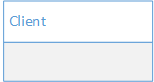

## 定义

为对象提供一个代理对象，以控制对这个对象的访问。

> 代理模式通过创建一个代理对象，用代理对象去代表真实的对象。当客户端操作代理对象时，最终还是会由真实对象来完成。

> 代理模式的本质：控制对象访问。


## UML



- Proxy: 代理对象，通常具有与具体目标对象一样的接口。持有具体目标对象的引用
- Subject: 目标接口，定义代理和具体目标对象的接口
- RealSubject: 具体的目标对象，真实实现目标接口要求的功能。

## 代码实现

```java

public interface Subject {
    void request();
}

public class RealSubject implements Subject {
    public void request() {
        System.out.println("具体目标对象");
    }
}

public class Proxy implements Subject {
    private Subject subject;
    public Proxy(Subject subject) {
        this.subject = subject;
    }
    
    public void request() {
        System.out.println("通过代理对象来访问真实对象");
        subject.request();
    }
}

public class Application {
    public static void main(String[] args){
      Subject subject = new Proxy(new RealSubject());
      subject.request();
    }
}

```

## 代理的分类

- 虚代理：根据需要来创建开销很大的对象，该对象只有在需要的时候才会被真正创建
- 远程代理：为不同地址空间中的对象提供一个本地表示；例如RMI技术
- 保护代理：控制原始对象的访问权限


## 适用场景

以下情况可以考虑使用代理模式

- 需要为一个对象在不同的地址空间提供局部代表时，可以使用远程代理
- 需要按照需要创建开销很大的对象时，可以使用虚代理。
- 需要控制对原始对象的访问，可以使用保护代理