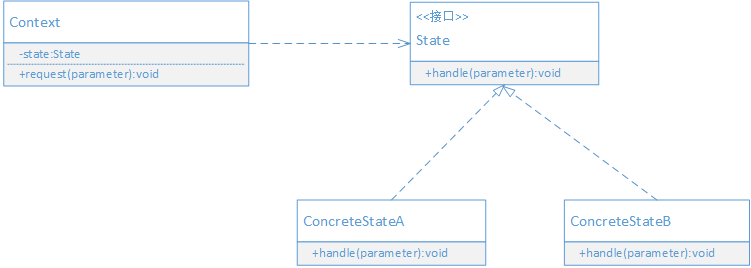

## 定义

允许一个对象在其内部状态改变时改变它的行为，对象看起来好像修改了它的类。

> 状态模式的本质: 根据状态来分离和选择行为。

> 状态模式的功能就是分离状态的行为，通过维护状态的变化，来调用不同状态对应的不同功能。

> 在状态模式中，由状态决定行为。状态在运行期被改变，因此行为也会在运行期根据状态的改变而改变。

## UML



- Context: 上下文，定义客户感兴趣的接口，同时维护一个来具体处理当前状态的实例对象。
- State: 状态接口，封装与上下文的特定状态所对应的行为。
- ConcreteState: 具体状态处理类，实现与上下文相关的状态的具体处理。

## 场景案例

考虑一个在线投票的应用

- 同一个用户只能投一票
- 如果用户反复投票次数超过5次，就认为是恶意刷票，并取消该用户的投票记录
- 如果用户号投票次数超过超过8次，将进入黑名单

## 代码实现

```java

/**
 * 封装投票状态相关的行为
 */
public interface VoteState {
    void processVote(String user, String voteItem, VoteManager voteManager);
}

/**
 * 正常投票
 */
public class NormalVoteState implements VoteState {
    @Override
    public void processVote(String user, String voteItem, VoteManager voteManager) {
        voteManager.getMapVote().put(user, voteItem);
        System.out.println("投票成功");
    }
}

/**
 * 重复投票
 */
public class RepeatVoteState implements VoteState {

    @Override
    public void processVote(String user, String voteItem, VoteManager voteManager) {
        System.out.println("请不要重复投票");
    }
}

/**
 * 恶意投票
 */
public class SpiteVoteState implements VoteState {
    @Override
    public void processVote(String user, String voteItem, VoteManager voteManager) {
        String s = voteManager.getMapVote().get(user);
        if(s != null) {
            voteManager.getMapVote().remove(user);
        }
        System.out.println("恶意刷票，取消投票记录");
    }
}

public class BlackVoteState implements VoteState {
    @Override
    public void processVote(String user, String voteItem, VoteManager voteManager) {
        System.out.println("加入黑名单");
    }
}


/**
 * 投票管理
 */
public class VoteManager {
    private VoteState state = null;

    private Map<String, String> mapVote = new HashMap<>();

    private Map<String, Integer> mapVoteCount = new HashMap<>();

    public Map<String, String> getMapVote() {
        return mapVote;
    }

    public void vote(String user, String voteItem) {
        Integer oldVoteCount = mapVoteCount.get(user);
        if(oldVoteCount == null) {
            oldVoteCount = 0;
        }

        oldVoteCount = oldVoteCount + 1;
        mapVoteCount.put(user, oldVoteCount);

        if(oldVoteCount == 1) {
            state = new NormalVoteState();
        } else if (oldVoteCount > 1 && oldVoteCount < 5) {
            state = new RepeatVoteState();
        } else if (oldVoteCount >= 5 && oldVoteCount < 8) {
            state = new SpiteVoteState();
        } else {
            state = new BlackVoteState();
        }

        state.processVote(user, voteItem, this);
    }
}


// 调用演示
public class Application {
    public static void main(String[] args) {
        VoteManager vm = new VoteManager();
        for(int i = 0; i < 8; i++) {
            vm.vote("u1", "A");
        }
    }
}

```

## 好处 

- 简化应用逻辑控制
- 更好地分离状态和行为
- 更好的扩展性

## 适用场景

- 如果一个对象的行为会随着它的状态的改变而变化，就可以使用状态模式来把状态和行为分离开。
- 如果一个操作中含有庞大的多分支语句，并且这些分支依赖于对象的状态，就可以使用状态模式，把各个分支处理分散到单独的对象处理类中，这样，这些分支对应的对象就可以不依赖于其他对象而独立变化。
