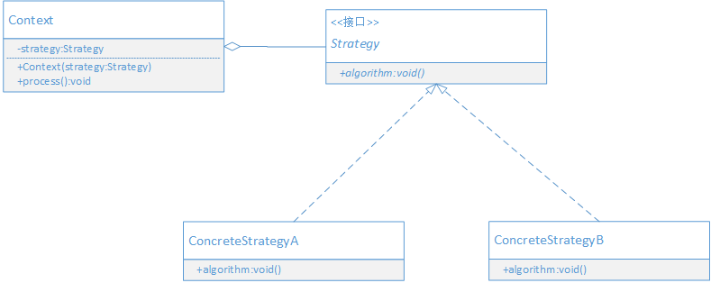

## 定义

定义一系列的算法，把它们一个个封装起来，并且使它们可相互替换。使得算法可以独立于它的使用者而变化。

> 策略模式的本质是：分离算法，选择实现。
> 策略模式的功能是把具体的算法实现从具体的业务处理中独立出来，把它们实现成单独的算法，形成一系列可以相互替换的算法。
> 策略模式的重心不是如何实现算法，而是如何组织，调用这些算法。
> 策略模式中各个具体策略是平等，因此可以相互替换


## UML



- Strategy: 策略接口，用来约束一系列具体的策略算法。
- ConcreteStrategy: 具体的策略实现
- Context: 上下文，负责调用具体策略。其目的是让使用者和策略接口解耦

## 场景案例

在CRM系统中，通常会有报价管理模块，其功能如下：

通常情况下

- 对普通客户或者新客户的价格是全价
- 对老客户的价格，统一折扣5%
- 对大客户的价格，统一折扣10%

在公司周年庆时，所有客户额外增加3%的折扣；换季时，普通客户额外增加2%折扣，老客户额外增加3%折扣，大客户额外增加5%折扣。

这意味着计算报价的方式经常被修改或被切换。假如不采用设计模式，就需要通过修改if-else来控制计算逻辑。时间长了这样大量的

if-else会导致可维护性，可扩展性变得很差。

这种情况，可以采用策略模式让计算报价的算法，可以动态切换的同时提高了可维护性，可扩展性。

## 思路

先把所有计算方式独立出来，每个计算方式做成一个单独的算法类，从而形成一系列可以相互替换的

算法。这样新增算法只需新增一个算法实现类；维护某个算法，只需修改具体的算法实现类即可，不会

对其他代码造成影响。这样就解决可维护和可扩展的问题了。

为了让算法独立于使用他的客户端，引入一个上下文对象，这个对象持有算法接口，由客户选择具体的算

法，设置到上下文对象中，上下文对象调用具体的算法。这样具体算法和算法的使用是分离的。

## 代码实现

1. 首先定义报价算法接口

```java

public interface Quote {
    double quotePrice(double goodsPrice);
}

```

2. 具体的报价算法实现

```java

// 普通客户或新客户
public class NormalCustomerQuote implements Quote {
    public double quotePrice(double goodsPrice) {
        System.out.println("对于新客户或者是普通客户，没有折扣，价格为" + goodsPrice);
        return goodsPrice;
    }
}


// 老客户
public class OldCustomerQuote implements Quote {
    public double quotePrice(double goodsPrice) {
        goodsPrice = goodsPrice * (1 - 0.05);
        System.out.println("对于老客户, 统一折扣5%, 折后价格为" + goodsPrice);
        return goodsPrice;
    }
}

// 大客户
public class LargeCustomerQuote implements Quote {
    public double quotePrice(double goodsPrice) {
        goodsPrice = goodsPrice * (1 - 0.1);
        System.out.println("对于大客户, 统一折扣10%, 折后价格为" + goodsPrice);
        return goodsPrice;
    }
}

```

3. 上下文的实现
```java

public class PriceContext {
    private static PriceContext CONTEXT = new PriceContext();
    private PriceContext() {   
    }
    
    public static PriceContext getInstance() {
        return CONTEXT;
    }
    
    private static Map<String, Quote> quoteMap = new HashMap<>();
    static {
        quoteMap.put("large", new LargeCustomerQuote());
        quoteMap.put("old", new OldCustomerQuote());
        quoteMap.put("normal", new NormalCustomerQuote());
    }
    
    public double quotePrice(String customerType, double goodsPrice) {
        Quote quote = quoteMap.get(customerType);
        return quote.quotePrice(goodsPrice);
    }
}

```

4. 客户端

```java

public class Application {
    public static void main(String[] args){
       PriceContext context = PriceContext.getInstance();
       context.quotePrice("large", 150.0);
       context.quotePrice("old", 150.0);
       context.quotePrice("normal", 150.0);
    }
}

```

## 好处 

- 使一系列平等的算法之间可以动态的进行替换
- 避免了多重条件语句，从而提高可读性，可维护性，可扩展性。

## 对设计原则的体现

- 策略模式很好地体现了开-闭原则。
- 策略模式也很好地体现了里氏替换原则。

## 适用场景

- 当出现同一个算法，有很多不同实现的情况下，可以使用策略模式来把这些不同的地方实现成一个算法的类层次。
- 当出现一个定义了很多行为的类，并且是通过if-else语句来选择这些行为的情况下，可以使用策略模式来代替if-else语句。