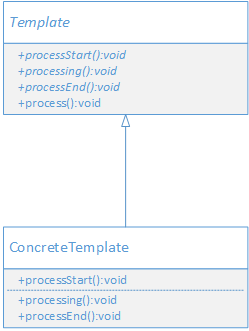

## 定义

定义算法的总体结构，将某些步骤交由子类来实现；让子类细化算法的某些步骤；但是子类不能改变算法的总体结构。

> 模板方法的本质是：固定算法结构。

## UML



- Template: 模板父类，定义算法的结构，子类通过实现抽象方法来实现算法的特定步骤。
- ConcreteTemplate: 具体实现类，实现算法中的某些步骤。

## 场景案例

假设有一个数据处理的功能，其需求如下

1. 数据来源有两种：数据库和文件。
2. 无论哪种数据来源，处理步骤都是一样的
    - 读取数据
    - 分析数据
    - 处理数据
    - 写数据(写入文件或写入数据库)。

如果不采用设计模式，那么两种数据来源的处理代码会存在大量重复，因此可以采用模板方法来实现上述功能。

## 代码实现

1. 定义数据处理的算法结构
```java

public abstract class DataParser {
    
    public final void process() {
        readData();
        analysisData();
        processData();
        writeData();
    }
    
    protected void analysisData() {
        System.out.println("使用缺省的分析数据步骤");
    }
    
    protected abstract void readData();
    protected abstract void processData();
    protected abstract void writeData();
}

```

2. 实现数据处理的算法的某些步骤

```java

// 实现处理文件数据
public class FileDataParser extends DataParser{
    
    protected void analysisData() {
        System.out.println("对文件中的数据进行分析");
    }

    protected void readData() {
        System.out.println("从文件中读取数据");
    }

    protected void processData() {
        System.out.println("处理文件中的数据");
    }
    protected void writeData() {
        System.out.println("将处理后的数据写入文件");
    }
}

// 实现处理数据库数据
public class DatabaseDataParser extends DataParser{
    
   protected void readData() {
       System.out.println("从数据库中读取数据");
   }

   protected void processData() {
       System.out.println("处理数据库中的数据");
   }
   protected void writeData() {
       System.out.println("将处理后的数据写入数据库");
   }
}

```

3. 演示调用
```java

public class Application {

    public static void main(String[] args) {
        DataParser parser = new FileDataParser();
        parser.process();
        System.out.println("=============================");
        parser = new DatabaseDataParser();
        parser.process();
    }
}

```

## 好处 

1. 实现代码复用。模板方法使得算法流程可以复用，而无需每个子类都实现一次。
2. 规范流程和不能改变流程。模板方法规定了算法的流程，子类可以改变某些算法的实现，但不能改变整个算法的流程。

## 对设计原则的体现

模板方法很好地体现了开闭原则。模板方法如果要扩展新的功能，只能使用子类扩展，而不能修改超类的流程。

模版方法体现了"好莱坞"原则。即 don't call us, we'll call you。在模板方法中，子类只负责实现某些步骤，而这些步骤什么时候调用，是由父类来控制的。

## 适用场景

- 需要固定算法结构，并把一些可变的步骤交给子类实现时，就可以使用模板方法模式。